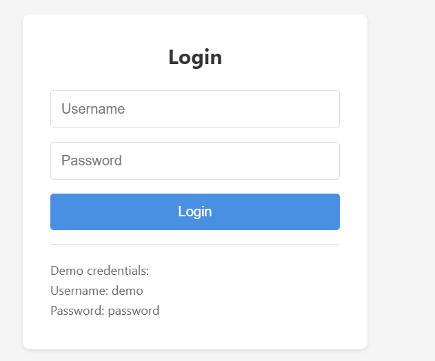
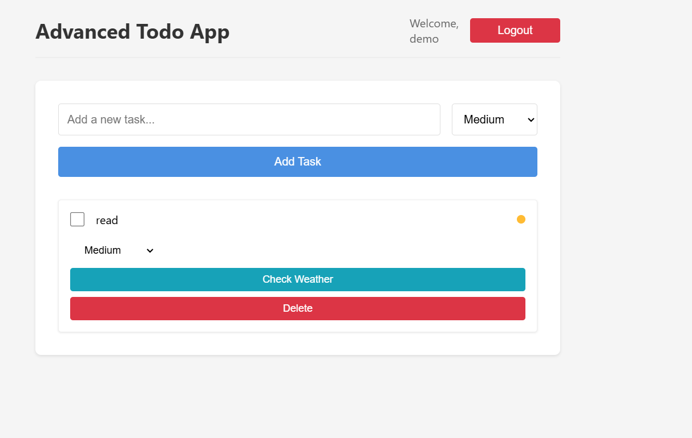

# Advanced React Todo Application

A feature-rich Todo application built with React, Redux, and modern web technologies. This application includes user authentication, task management with priorities, weather integration, and responsive design.

## Features

- User Authentication (Login/Logout)
- Task Management (Add, Delete, Toggle)
- Task Prioritization (High, Medium, Low)
- Weather Integration for Tasks
- Responsive Design
- Local Storage Persistence
- Redux State Management
- Modern UI/UX

## Screenshots

### Login Page

The login page provides a clean and simple interface for user authentication. It includes username and password fields along with demo credentials for easy testing.

### Main Application

The main application interface showcases the todo management system with features like:
- Task input field with priority selection
- Task list with completion checkboxes
- Weather check functionality for each task
- Task deletion option
- Clean, responsive design with a user-friendly layout

## Prerequisites

- Node.js (v14 or higher)
- npm or yarn
- OpenWeather API Key (for weather functionality)

## Setup

1. Clone the repository:
```bash
git clone <repository-url>
cd advanced-todo-app
```

2. Install dependencies:
```bash
npm install
```

3. Create a `.env` file in the root directory and add your OpenWeather API key:
```
REACT_APP_WEATHER_API_KEY=your_api_key_here
```

4. Start the development server:
```bash
npm start
```

The application will be available at `http://localhost:3000`

## Demo Credentials

- Username: demo
- Password: password

## Project Structure

```
src/
├── components/
│   ├── auth/
│   │   └── Login.js
│   ├── tasks/
│   │   ├── TaskInput.js
│   │   ├── TaskList.js
│   │   └── TaskItem.js
│   └── TodoApp.js
├── store/
│   ├── slices/
│   │   ├── authSlice.js
│   │   ├── todoSlice.js
│   │   └── weatherSlice.js
│   └── index.js
├── App.js
└── index.js
```

## Technologies Used

- React
- Redux Toolkit
- React Router
- Axios
- CSS3 (with Flexbox and Grid)
- Local Storage

## Contributing

1. Fork the repository
2. Create your feature branch (`git checkout -b feature/amazing-feature`)
3. Commit your changes (`git commit -m 'Add some amazing feature'`)
4. Push to the branch (`git push origin feature/amazing-feature`)
5. Open a Pull Request

## License

This project is licensed under the MIT License - see the LICENSE file for details. 